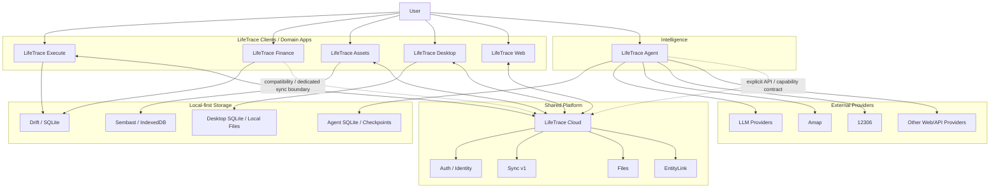

# LifeTrace Architecture Hub

> LifeTrace 系列的总架构、仓库边界、跨应用契约与架构决策中心。

## 仓库定位

`LifeTraceManage/LifeTrace` **不再是 LifeTrace 的可运行 Monorepo，也不再承担任何生产应用的源码职责**。

LifeTrace 已拆分为多个独立仓库。各产品的实现、测试、CI、发布与运行配置，以对应子仓库为唯一事实来源；本仓库只维护 **跨仓库、跨产品、跨平台的系统级设计**。

旧 Monorepo 中遗留的 `apps/`、`services/`、`crates/`、`contracts/`、`deploy/` 等内容仅视为历史资料，在完成清理前不得再作为构建、部署或开发依据。

## LifeTrace 系列

| 仓库 | 角色 | 当前主要技术栈 |
| --- | --- | --- |
| [LifeTrace-execute](https://github.com/LifeTraceManage/LifeTrace-execute) | 执行中心：Today、Task、Project、Calendar、Collection、Review、Focus 等 | Flutter / Riverpod / Drift / SQLite |
| [LifeTrace-finance](https://github.com/LifeTraceManage/LifeTrace-finance) | 财务中心：账本、账户、交易、预算、导入、AI 记账 | Flutter / Riverpod / Drift，基于 BeeCount 演进 |
| [LifeTrace-assets](https://github.com/LifeTraceManage/LifeTrace-assets) | 资产中心：资产全生命周期、估值、提醒、跨应用 EntityLink | Flutter / Sembast / IndexedDB |
| [LifeTrace-desktop](https://github.com/LifeTraceManage/LifeTrace-desktop) | 桌面原生入口与本地能力承载 | Tauri 2 / React / TypeScript / Rust |
| [LifeTrace-web](https://github.com/LifeTraceManage/LifeTrace-web) | 浏览器入口与 Web 聚合界面 | React 19 / TypeScript / Vite |
| [LifeTrace-cloud](https://github.com/LifeTraceManage/LifeTrace-cloud) | 共享云平台：Auth、Sync、Files、EntityLink、跨端公共能力 | Rust / Axum / PostgreSQL |
| [LifeTrace-agent](https://github.com/LifeTraceManage/LifeTrace-agent) | 本地智能 Agent 平台：工作流、能力调度、浏览器/API 插件 | Python / FastAPI / LangGraph / PydanticAI |

## 总体架构

核心原则：

1. **Domain ownership 明确**：Task 属于 Execute，Finance 数据属于 Finance，Asset 生命周期属于 Assets。
2. **Local-first 优先**：原生应用的核心 CRUD 不依赖 Cloud 在线。
3. **Cloud 是共享平台，不是巨型业务单体**：负责身份、同步、文件、跨应用链接等公共能力。
4. **跨应用只通过显式契约协作**：禁止通过读取另一个应用的私有数据库形成耦合。
5. **Agent 是独立执行层**：Agent 通过 capability/API 获取事实和执行动作，不直接侵入业务存储。
6. **每个仓库可独立构建、测试、发布**：总架构仓不持有产品构建链。
7. **OpenSpec 负责仓库内变更，ADR 负责跨仓库架构决策**。

## 架构文档入口

- [系统总架构](docs/architecture/SYSTEM_ARCHITECTURE.md)
- [仓库职责与边界](docs/architecture/REPOSITORY_BOUNDARIES.md)
- [数据、Local-first 与同步](docs/architecture/DATA_AND_SYNC.md)
- [Agent 平台架构](docs/architecture/AGENT_ARCHITECTURE.md)
- [架构治理与变更规则](docs/architecture/ARCHITECTURE_GOVERNANCE.md)
- [Architecture Decision Records](docs/architecture/adr/)

## Source of Truth

当文档出现冲突时，按以下层级判断：

1. **本仓库架构文档**：跨仓库边界、平台职责、系统级约束。
2. **各产品仓库的 README / architecture / requirements**：产品自身职责与运行架构。
3. **各仓库 OpenSpec**：正在实施或已经归档的具体变更设计。
4. **代码与测试**：当前真实实现状态。

如果第 1 层与产品实现发生冲突，必须通过 ADR 明确修改系统边界，而不是在某个子仓库里静默改变整体架构。

## 本仓库不再做什么

- 不新增业务源码；
- 不构建 Desktop、Web、Cloud 或任何 Flutter 应用；
- 不维护跨仓库复制的依赖；
- 不保存某个产品的私有实现细节作为总架构；
- 不把旧 Monorepo 目录当作生产来源。

本仓库的长期目标是成为 **LifeTrace 系列的 Architecture Handbook + ADR Registry + Repository Map**。
