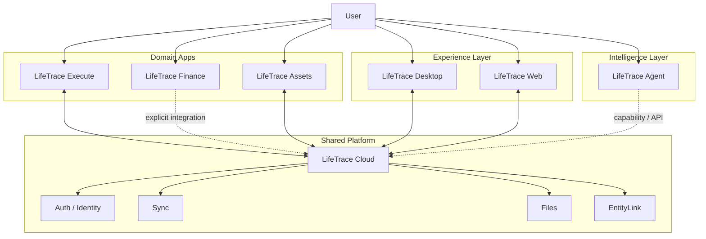

# LifeTrace Architecture Hub

> LifeTrace 系列的总架构、仓库边界、跨应用契约与架构决策中心。

## 仓库定位

`LifeTraceManage/LifeTrace` 现在是 **LifeTrace Architecture Hub**。

这个仓库不包含任何生产应用源码，不参与 Desktop、Web、Cloud、Flutter App 或 Agent 的构建、测试和部署。历史 Monorepo 源码已经从当前分支删除，仍可通过 Git 历史追溯，但不得再作为当前实现依据。

## LifeTrace 系列仓库

| 仓库 | 核心职责 |
| --- | --- |
| [LifeTrace-execute](https://github.com/LifeTraceManage/LifeTrace-execute) | 执行中心：Today、Task、Project、Calendar、Collection、Review、Focus、Goal/Habit |
| [LifeTrace-finance](https://github.com/LifeTraceManage/LifeTrace-finance) | 财务中心：账本、账户、交易、预算、导入、分析与财务 AI |
| [LifeTrace-assets](https://github.com/LifeTraceManage/LifeTrace-assets) | 资产中心：资产生命周期、估值、维护、提醒与 EntityLink |
| [LifeTrace-desktop](https://github.com/LifeTraceManage/LifeTrace-desktop) | 桌面原生入口、本地能力和桌面聚合体验 |
| [LifeTrace-web](https://github.com/LifeTraceManage/LifeTrace-web) | 浏览器入口与跨域 Web 体验 |
| [LifeTrace-cloud](https://github.com/LifeTraceManage/LifeTrace-cloud) | 共享平台：Auth、Sync、Files、EntityLink 与公共 API |
| [LifeTrace-agent](https://github.com/LifeTraceManage/LifeTrace-agent) | 智能执行层：Workflow、Capability、Browser/API Adapter、Evidence、HITL |

## 总体架构

## 核心原则

1. **明确领域所有权**：Task 属于 Execute，Finance 数据属于 Finance，Asset 生命周期属于 Assets。
2. **Local-first 优先**：领域 App 的核心业务不依赖 Cloud 持续在线。
3. **Cloud 是共享平台，不是超级业务单体**。
4. **跨应用只通过显式契约协作**，不直接读取其他 App 私有数据库。
5. **Agent 是推理和执行编排层**，不接管领域实体所有权。
6. **各仓库独立构建、测试、发布**。
7. **跨仓库架构决策进入 ADR；仓库内部变更进入各自 OpenSpec**。

## 架构文档

- [系统总架构](docs/architecture/SYSTEM_ARCHITECTURE.md)
- [仓库职责与边界](docs/architecture/REPOSITORY_BOUNDARIES.md)
- [数据、Local-first 与同步](docs/architecture/DATA_AND_SYNC.md)
- [Agent 平台架构](docs/architecture/AGENT_ARCHITECTURE.md)
- [架构治理](docs/architecture/ARCHITECTURE_GOVERNANCE.md)
- [Architecture Decision Records](docs/architecture/adr/)

## Source of Truth

当资料冲突时：

1. 本仓库：跨仓库架构、边界和系统级约束；
2. 各产品仓库：产品自身需求、实现和运行架构；
3. 各产品仓库 OpenSpec：具体变更；
4. 当前代码与自动化测试：实现事实。

任何 AI 或开发者都不应从本仓库寻找产品源码。需要分析某个产品时，应直接进入对应的 `LifeTrace-*` 仓库。

## 仓库内容规则

本仓库允许：

- Markdown 架构文档；
- Mermaid / PlantUML 等架构图源码；
- ADR；
- 极少量仓库治理配置。

本仓库禁止：

- 应用源码；
- Docker / deployment 配置；
- package / Cargo / Flutter 构建文件；
- 产品数据库 migration；
- 产品级 API contract 实现；
- 为了“方便”复制其他仓库代码。

详细规则见 [AGENTS.md](AGENTS.md)。
