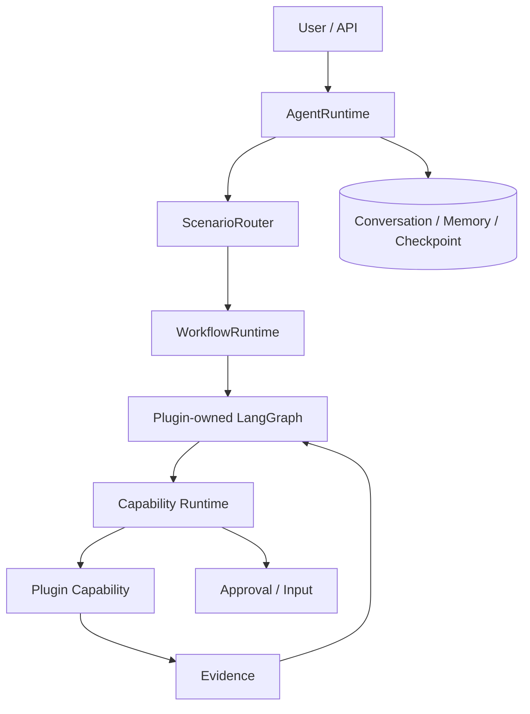

# LifeTrace Agent 平台架构

## 1. 定位

`LifeTrace-agent` 是 LifeTrace 的智能执行层，而不是另一个业务单体。

它负责“理解意图 → 选择工作流 → 调用能力 → 获取事实 → 需要时请求人工批准 → 返回结果”，但不取代 Execute、Finance、Assets 的领域逻辑。

## 2. 生产架构



当前边界：

- LangGraph：workflow state、node/edge、checkpoint、interrupt/resume；
- AgentRuntime：conversation、context、task/run lifecycle；
- ScenarioRouter：只能选择已注册 workflow；
- Capability Runtime：唯一 capability 执行入口；
- PydanticAI：bounded typed LLM helper，不拥有主工作流生命周期；
- Browser：plugin-private infrastructure，不暴露为任意主 Agent 工具；
- Evidence：保存实时事实来源和可审计结果。

## 3. 与 LifeTrace 业务域协作

正确模式：

```text
User: "把我买的新电脑加入资产，并创建一个半年后检查电池健康的任务"

Agent
  -> asset.create capability
  -> Assets public boundary
  -> returns asset id
  -> execution.task.create capability
  -> Execute public boundary
  -> entity.link.create
  -> Cloud / EntityLink
```

Agent 不应：

- 直接打开 Assets 本地数据库插入一行；
- 直接写 Execute Drift 表；
- 在 prompt 中暴露 Cloud Secret；
- 让模型自行构造任意 SQL；
- 把浏览器 cookie 传给 LLM。

## 4. Capability Contract

建议统一 capability descriptor：

```text
id
version
input_schema
output_schema
side_effect_level
required_scopes
approval_policy
budget_cost
provider
evidence_policy
```

side effect 至少区分：

- read-only；
- reversible write；
- external side effect；
- high-impact action。

## 5. Browser 与 Session

Browser session 属于本地敏感基础设施。

原则：

- profile/session 只保存在本机；
- Cookie、LocalStorage、StorageState 不进入 LLM prompt；
- 查询态与登录/执行态可以使用不同 profile；
- 真正产生订单、付款、删除等副作用前保留 HITL；
- 浏览器只是 provider adapter 的实现方式之一，不是业务事实本身。

## 6. Agent 与 Cloud

Agent 访问 LifeTrace Cloud 时也必须走显式 API/capability。

未来可以形成：

```text
LifeTrace Cloud API
     ▲
     │ authenticated capability
LifeTrace Agent
     │
     ├─ Execute adapter
     ├─ Finance adapter
     ├─ Assets adapter
     └─ third-party plugins
```

这样 Agent 可以跨应用规划，但不会破坏 bounded context。
