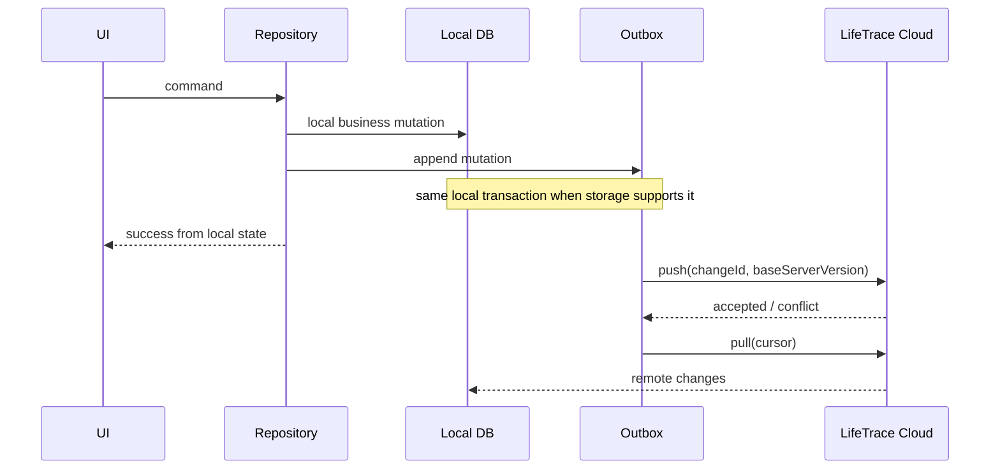

# LifeTrace 数据、Local-first 与同步架构

## 1. 数据所有权

LifeTrace 的核心规则是：

> **业务数据由领域应用拥有，Cloud 保存可同步的服务端事实，跨应用通过链接和契约协作。**

不得把“Cloud 有一份副本”误解为“Cloud 拥有所有领域规则”。

## 2. Local-first 标准路径

适用于 Execute、Assets，以及采用同类模式的后续原生应用：



关键语义：

- `changeId` 幂等；
- `baseServerVersion` 用于乐观并发；
- durable outbox；
- snapshot 用于首次绑定/恢复；
- cursor 用于增量拉取；
- tombstone 表达删除；
- retry 必须区分临时失败和永久失败；
- conflict 必须持久化，不允许静默丢弃本地意图。

## 3. Sync v1 是协议，不是 ORM

不同应用可以使用不同本地存储：

- Execute：Drift / SQLite；
- Assets：Sembast / IndexedDB；
- Desktop：SQLite + local files；
- Agent：SQLite + LangGraph checkpoint store。

只要保持协议语义一致，就不要求本地数据结构相同。

## 4. Finance 兼容边界

Finance 由 BeeCount 基础演进而来，已经存在多种同步方案和自身兼容约束。

因此：

- Finance 不应为了“看起来统一”而立即删除成熟同步能力；
- LifeTrace Cloud 与 Finance 的整合应通过 adapter / compatibility layer / dedicated migration 实现；
- 任何把 Finance 强制迁移为通用 Sync v1 的决定都必须单独 ADR + migration plan；
- Finance 的业务模型仍由 Finance 仓库负责。

## 5. EntityLink

EntityLink 用于跨应用关联，不复制目标实体正文。

推荐模型：

```text
EntityLink
- id
- ownerUserId
- sourceType
- sourceId
- targetType
- targetId
- displayName?   # 可选展示缓存，不是 authoritative data
- createdAt
- updatedAt
- deletedAt?
```

要求：

- type 使用稳定 namespace，例如 `asset.asset`、`execution.task`；
- 删除链接不删除目标实体；
- 展示缓存失效不影响引用身份；
- 权限校验由 Cloud / capability boundary 执行。

## 6. 文件数据

文件分为两层：

```text
metadata -> LifeTrace Cloud/PostgreSQL
binary   -> local file or object storage
```

数据库中不应无条件塞入所有大型二进制对象。上传/下载优先使用短时签名 URL 或明确的文件接口。

## 7. 隐私与删除

数据删除必须考虑：

- 本地副本；
- Cloud 数据库；
- object storage；
- outbox；
- tombstone；
- checkpoint / cache；
- Agent evidence 中是否持有敏感摘要。

“账号已删除”必须对应真实的物理/逻辑清理能力，不能只删一个 user row 就宣称所有外部对象已经清除。

## 8. 跨应用数据访问

优先使用：

1. public API；
2. Sync contract；
3. EntityLink；
4. export/import；
5. Agent capability。

禁止以共享数据库文件作为跨应用集成方案。
