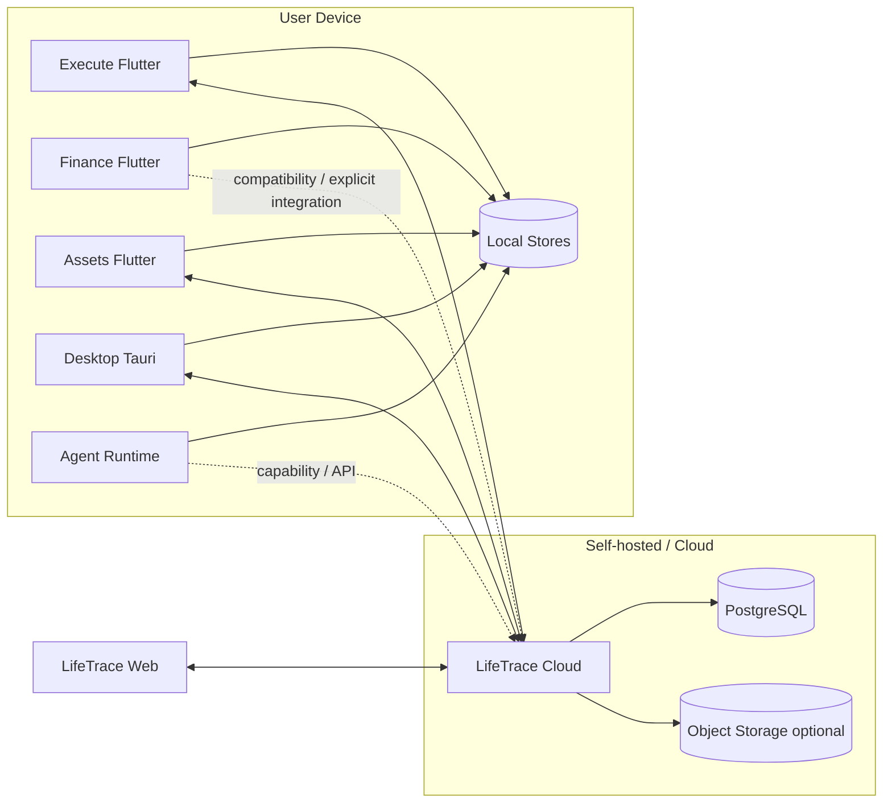

# LifeTrace 系统总架构

状态：Active  
范围：LifeTraceManage 组织下的 LifeTrace 系列  
更新时间：2026-09-21

## 1. 系统目标

LifeTrace 的目标是构建一个长期可演进的个人数字系统。它不是单一 App，也不是把所有功能继续塞回一个 Monorepo，而是把不同生活领域拆成可以独立演进的产品，同时复用统一的身份、同步、文件与跨应用连接能力。

架构采用：

> **Domain Apps + Local-first Data + Shared Cloud Platform + Explicit Cross-App Contracts + Independent Agent Runtime**

## 2. 逻辑分层

### 2.1 Domain Application Layer

领域应用对自己的业务模型拥有最终解释权。

- **Execute**：任务、项目、日历、收集、复盘、专注、目标/习惯等执行域。
- **Finance**：账本、交易、账户、预算、导入、财务分析与财务 AI。
- **Assets**：实物/个人资产、生命周期事件、估值、维护、出售/退役。
- 后续新增领域（例如 Health、Knowledge）必须继续采用同样的 ownership 原则。

一个领域实体只能有一个 authoritative owner。其他应用如果需要引用它，应保存稳定引用，而不是复制整个实体并形成第二份真相。

### 2.2 Experience Layer

- **LifeTrace Desktop**：承载桌面原生能力、本地文件、本地 SQLite、系统集成和跨域桌面体验。
- **LifeTrace Web**：浏览器入口、在线查看和适合 Web 的聚合体验。

Experience Layer 可以组合多个领域的展示，但不得因此接管领域模型所有权。

### 2.3 Shared Platform Layer

**LifeTrace Cloud** 是公共平台层，主要负责：

- Identity / Auth / Session / Device；
- Sync v1；
- File metadata / object transfer boundary；
- EntityLink；
- Privacy export / account lifecycle；
- 需要统一托管的跨端公共 API。

Cloud 不应变成“所有业务都写在一个后端中的大单体”。领域特有规则应优先由领域仓库定义，通过通用实体同步、明确 API 或专用适配器接入。

### 2.4 Intelligence Layer

**LifeTrace Agent** 是独立的智能执行平台，负责：

- conversation / session / task runtime；
- workflow 编排；
- LLM structured decision；
- capability policy、授权、审批与预算；
- 浏览器/API adapter；
- Evidence；
- 人机协同操作。

Agent 不拥有 Execute/Finance/Assets 的业务实体，也不应直接打开这些应用的私有 SQLite 数据库进行写操作。

## 3. 物理部署关系



## 4. 关键架构原则

### 4.1 Local-first is a product property

Local-first 不是“加一层缓存”。对原生领域应用，它意味着：

- 核心读取来自本地库；
- 核心写入先在本地事务成功；
- Cloud 不在线时依然可以完成业务操作；
- 需要同步的变更进入 durable outbox；
- 恢复联网后进行幂等同步；
- 冲突必须有确定语义，不能靠 last-write-wins 隐式覆盖所有业务。

### 4.2 Cloud is shared infrastructure

Cloud 提供跨应用一致的 platform primitives，而不是要求所有应用拥有相同内部结构。

推荐复用：

- Auth v1；
- Sync v1 envelope；
- cursor / snapshot / push / pull；
- serverVersion / conflict；
- file transport；
- typed EntityLink。

不要求强制复用：

- 每个领域的 UI state；
- 本地 ORM；
- 领域内部表设计；
- 不同产品已经存在且有明确兼容要求的第三方同步机制。

### 4.3 Explicit integration over hidden coupling

跨应用集成优先顺序：

1. typed shared contract；
2. Cloud API；
3. EntityLink；
4. Agent capability；
5. 明确的 import/export protocol。

禁止：

- 直接查询另一个 App 的 SQLite 文件；
- 依赖另一个仓库内部 class/module；
- 在多个仓库复制同一实体并分别维护；
- 通过数据库共享表绕过 API/contract。

### 4.4 Independent release

每个产品仓库必须可以：

- 独立 clone；
- 独立安装依赖；
- 独立测试；
- 独立构建；
- 独立发布。

跨仓库兼容通过协议版本和 contract tests 控制，而不是通过“必须一起 checkout”。

## 5. 当前仓库拓扑

```text
LifeTrace                    # architecture hub，非运行仓
├── LifeTrace-execute        # execution domain
├── LifeTrace-finance        # finance domain
├── LifeTrace-assets         # asset domain
├── LifeTrace-desktop        # desktop experience / native capabilities
├── LifeTrace-web            # browser experience
├── LifeTrace-cloud          # shared cloud platform
└── LifeTrace-agent          # local agent / intelligent execution
```

## 6. 长期演进方向

长期架构应继续坚持“新增领域，不扩大旧单体”：

```text
New requirement
   │
   ├─ belongs to existing bounded context -> implement in that repository
   │
   ├─ cross-domain shared primitive -> LifeTrace-cloud + ADR
   │
   ├─ cross-domain user experience -> Web/Desktop
   │
   └─ reasoning / planning / action orchestration -> LifeTrace-agent
```

如果一个功能同时跨越多个 bounded context，先定义 contract 和 ownership，再开始写代码。
